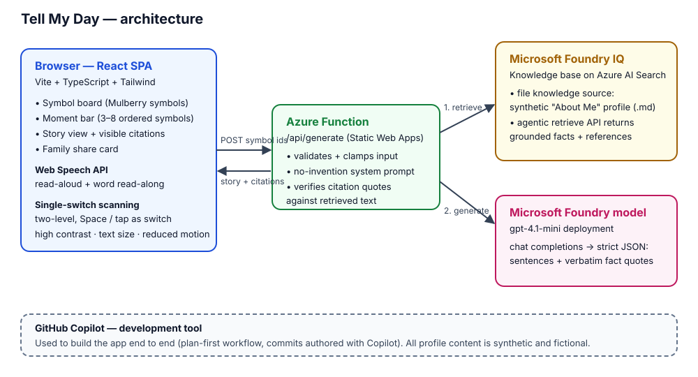

# Tell My Day

An accessibility-first AAC (augmentative and alternative communication) web app. A non-speaking adult taps 3–8 picture symbols (people, places, activities, feelings, food); the app turns that into 2–4 warm, first-person sentences **grounded in their "About Me" profile via Microsoft Foundry IQ**, shows the story with the symbols and its sources inline, and reads it aloud.

Built by a direct support professional.

> **Synthetic data only.** Every "About Me" profile entry shipped with this repo is fictional ("Joey", "Marcus", "Biscuit the dog", "Brew Bird coffee shop" — all invented). No real people, places, organizations, or care-setting data appears anywhere in this repo or its history.

## The problem

Many non-speaking people use symbol boards to communicate in the moment, but sharing *how their day went* — in their own voice, as a story — is much harder. Caregivers often end up narrating for them. Tell My Day flips that: the person picks the symbols, and the story is theirs — personal (it knows their people, places, and routines) without ever putting words in their mouth.

## The no-invention guardrail (core feature)

The story may use **only** (a) the ideas in the selected symbols and (b) facts retrieved from the Foundry IQ knowledge base. The model must cite a verbatim quote for every fact it uses, and the server **re-verifies each quote against the retrieved text** before showing it. If a symbol has no matching profile fact (try *Grandma*, *Beach*, or *School*), the story stays general — "my friend", never a made-up name — and the UI says so explicitly.

## Accessibility is the product

- **Two-level single-switch scanning** — regions auto-highlight in turn; one switch (Space, or a tap anywhere on screen) drills in and selects. Adjustable scan speed (0.8 s / 1.2 s / 2 s).
- **Foundry IQ grounding with visible citations** — reliability is an accessibility feature: a user who can't easily correct the output must be able to trust it.
- Full keyboard operation: ARIA tablist for categories, arrow-key reordering in the moment bar, skip link, visible 4 px focus rings.
- Read-aloud via the Web Speech API with play/pause, speed, pitch, and word-by-word read-along highlighting.
- ≥ 64 px tap targets everywhere; icon + visible label + `aria-label` on every control.
- High-contrast theme, adjustable text size (scales every font), reduce-motion toggle that also honors `prefers-reduced-motion`.
- Story output in an `aria-live="polite"` region; selection changes announced to screen readers.

## Caregiver profile editor

A parent/guardian/caregiver can edit the "About Me" profile from inside the app — footer → **Caregiver settings** → caregiver PIN. The five profile sections (people, places, activities, food, comfort) are edited as plain text and saved straight back to the Foundry IQ knowledge source, which stays the single source of truth (new facts reach stories after ~a minute of re-indexing). The PIN is verified server-side only (`CARETAKER_PIN` env var), and the entry button is deliberately excluded from switch scanning so the primary user can't open it by accident.

## How it works



1. The React SPA posts the ordered symbol ids to `/api/generate` (an Azure Function — the browser never sees a secret).
2. The function calls the **Foundry IQ knowledge base** (`retrieve` API, agentic retrieval over an Azure AI Search file knowledge source holding the synthetic profile markdown).
3. The retrieved, numbered facts plus the symbols go to **gpt-4.1-mini** (Microsoft Foundry) with a strict no-invention system prompt that demands JSON sentences with verbatim quotes for citations.
4. The server verifies every quote against the retrieved text, then the UI renders the story with citation markers, the "From the profile" panel, read-aloud, and a family share card.

**GitHub Copilot** was used throughout development (it authored the commits).

## Stack

- React 18 + Vite + TypeScript + Tailwind (single screen, single flow — no accounts, no database)
- Azure Static Web Apps: static frontend + managed Azure Functions (`/api/generate`, `/api/profile` — all secrets live in env vars)
- Microsoft Foundry IQ: knowledge base + file knowledge source on Azure AI Search
- Microsoft Foundry model deployment: gpt-4.1-mini
- Web Speech API (`speechSynthesis`) for voice

## Quickstart

```bash
npm install
cp .env.local.example .env.local   # fill in Foundry + Azure AI Search values
npm run setup:iq                   # one-shot: creates knowledge source + uploads profile + creates KB
npm run test:model                 # de-risk gate 1: model replies
npm run test:iq                    # de-risk gate 2: KB retrieve returns grounded references
npm run dev                        # http://localhost:5183
npm test                           # unit tests (validation, parsing, quote verification)
```

## Deploy (Azure Static Web Apps)

1. In the Azure portal, create a **Static Web App** (Free plan), deployment source **Other**.
2. Copy the deployment token (Overview → Manage deployment token) and add it to the GitHub repo as the `AZURE_STATIC_WEB_APPS_API_TOKEN` Actions secret.
3. In the Static Web App's **Environment variables**, add every var from `.env.local.example` — including `CARETAKER_PIN`, which gates the caregiver profile editor.
4. Push to `main`. The workflow in `.github/workflows/azure-static-web-apps.yml` builds the Vite app and deploys `api/` as managed Azure Functions.

## Contest

Microsoft Learn username: `YOUR-LEARN-USERNAME` <!-- TODO: fill in before submitting -->

## License

App code: MIT. Picture symbols are from the [Mulberry Symbol Set](https://mulberrysymbols.org), licensed CC BY-SA 4.0 — see `LICENSES/MULBERRY.md`.
